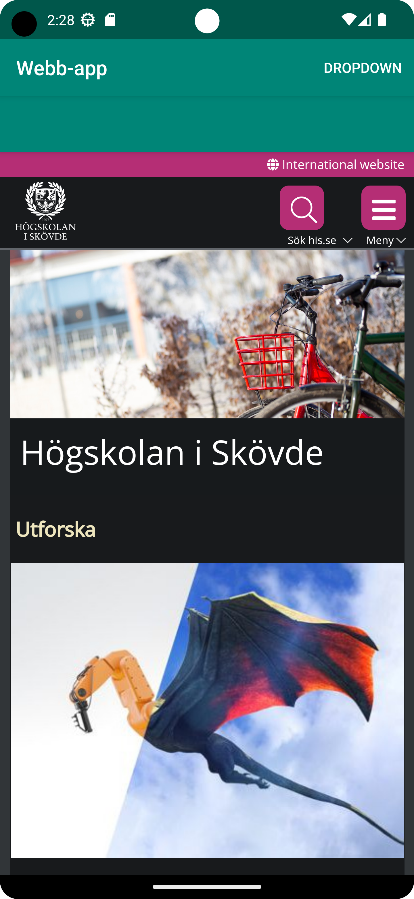
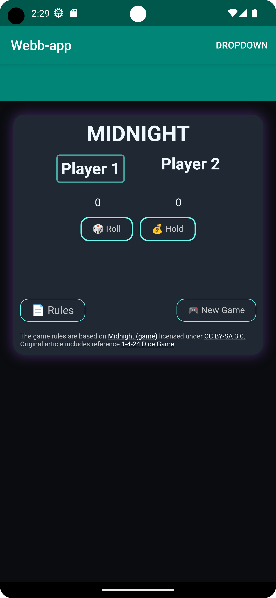

# Rapport Assignment 2: WebView

** WebView rapport **
Först tillät jag Internet i "uses-permission" taggen därefter ändrade jag 
namnet på appen till "Webb-app", ersatte "TextView" i activity_main med "WebView"
och gav den ett id "my_webview". Sedan skapar man en klass "MainActivity" som ärver funktionalitet
från klassen "AppCompatActivity" (se kodsnutt 1 nedan). I klassen finns skapas en två funktioner som
innehåller en intern url och en extern url i den andra som sedan sätts in i två if-satsar med
villkor som letar efter matchning av id från en dropdown meny så när användaren väljer ett element
i menyn så körs en av funktionerna (se kodsnutt 1 & 2 nedan).

```
public class MainActivity extends AppCompatActivity {
    WebView myWebView;


    @SuppressLint("SetJavaScriptEnabled")
    @Override
    protected void onCreate(Bundle savedInstanceState) {
        super.onCreate(savedInstanceState);
        setContentView(R.layout.activity_main);
        // Find view in layout
        myWebView = findViewById(R.id.my_webview);
        // Enable JS
        myWebView.getSettings().setJavaScriptEnabled(true);
        // Attach a webViewClient
        myWebView.setWebViewClient(new WebViewClient());
        
        }

        @Override
        public boolean onCreateOptionsMenu (Menu menu){
            // Inflate the menu; this adds items to the action bar if it is present.
            getMenuInflater().inflate(R.menu.menu_main, menu);
            return true;
        }

        @Override
        public boolean onOptionsItemSelected (MenuItem item){
            int id = item.getItemId();

            if (id == R.id.action_external_web) {
                Log.d("==>", "Will display external web page");
                showExternalWebPage();
                return true;
            }

            if (id == R.id.action_internal_web) {
                Log.d("==>", "Will display internal web page");
                showInternalWebPage();
                return true;
            }

            return super.onOptionsItemSelected(item);
        }

    public void showExternalWebPage(){
        myWebView.loadUrl("https://his.se");
    }

    public void showInternalWebPage(){
        myWebView.loadUrl("file:///android_asset/index.html");
    }
}
```
kodsnutt 1
```
<menu xmlns:android="http://schemas.android.com/apk/res/android"
    xmlns:app="http://schemas.android.com/apk/res-auto">
    <item
        android:id="@+id/menu_dropdown"
        android:title="@string/dropdown_menu"
        app:showAsAction="always">
        <menu>
            <item
                android:id="@+id/action_external_web"
                android:title="@string/action_external_web"
                app:showAsAction="ifRoom"/>
            <item
                android:id="@+id/action_internal_web"
                android:title="@string/action_internal_web"
                app:showAsAction="ifRoom"/>
        </menu>
    </item>
</menu>
```
kodsnutt 2




f22linbe